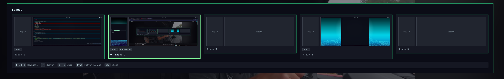

# Spaces

macOS-style **Spaces** for Hyprland on [Omarchy](https://omarchy.org/).

Hyprland gives each monitor its own independent workspaces. This plugin makes
**every monitor move together**, the way macOS Spaces do: a **space** *N* is
workspace `N + i×OFFSET` on the *i*-th monitor (primary is `i = 0`), and
switching a space flips all screens at once.

It adapts to whatever displays you have - one monitor, two, three, portrait,
mixed resolutions, any arrangement. The primary monitor is auto-detected (the
largest one) or set with `SPACES_PRIMARY`; the rest are ordered by physical
position.

`SUPER + CTRL + DOWN` opens a graphical overlay showing every space with a
screenshot of each monitor (laid out in the same left-to-right order as your
real displays), the apps running there, and a keybind bar. Start typing to
filter spaces by app name - `chr` highlights the space with Chromium - then
press Enter to switch.



## Bindings

| Keys | Action |
|------|--------|
| `SUPER + CTRL + LEFT` / `RIGHT` | Previous / next space |
| `SUPER + CTRL + DOWN` | Open/close the Spaces overlay |

`SUPER + arrow` stays window focus; `SUPER + CTRL + arrow` is the matching
"space". In the overlay: **arrows / Tab** move the selection, **Enter**
switches, **1-0** jump directly, **type** to filter by app name (Backspace
edits, Enter accepts), **Esc** clears the filter then closes, a click outside
closes.

`SUPER + 1`...`0` and `SUPER + SHIFT + 1`...`0` do what they always did - jump to
/ send a window to a numbered workspace - they just move every monitor together
now. The only binding actually repurposed is `SUPER + CTRL + LEFT` / `RIGHT`,
which Omarchy uses for "move grouped window focus" (`SUPER + ALT + arrow` still
manages window groups).

## Install

```bash
omarchy plugin add https://github.com/joshj91/omarchy-spaces.git --enable
~/.config/omarchy/plugins/joshj.spaces/install.sh
```

The installer adds a single marked loader block to
`~/.config/hypr/bindings.lua`, keeps a timestamped backup, reloads Hyprland,
and reverts automatically if the new config fails to validate. It then
registers the overlay with the Omarchy shell.

Needs `hyprctl`, `jq` and `grim` (all standard on Omarchy) and Hyprland's Lua
config. Without `grim` the overlay just uses the schematic layout everywhere.

## Uninstall

```bash
~/.config/omarchy/plugins/joshj.spaces/uninstall.sh
omarchy plugin remove joshj.spaces
```

## Configuration

Both are optional. Set them with `hl.env(...)` in `~/.config/hypr/bindings.lua`
*before* the loader block, or export them in your session:

| Variable | Default | Meaning |
|----------|---------|---------|
| `SPACES_PRIMARY` | largest monitor | Name of the monitor that holds workspaces `1-OFFSET` (`hyprctl monitors`). |
| `SPACES_OFFSET` | `10` | Per-monitor workspace-id offset. Monitor *i* uses `N + i×OFFSET`. |
| `SPACES_COUNT` | `5` | How many spaces prev/next steps through and the overlay always shows. |
| `SPACES_SNAPSHOT_SCALE` | `0.2` | Thumbnail scale for overlay screenshots. |

```lua
-- example, before the "-- >>> joshj.spaces bindings >>>" block
hl.env("SPACES_PRIMARY", "DP-1")
```

With `OFFSET = 10`: a two-monitor setup uses workspaces 1-10 and 11-20, a
three-monitor setup adds 21-30, and so on. On a single monitor the plugin
degrades to plain workspace switching.

## How it works

- `scripts/space-common.sh` resolves the monitor order: primary first
  (`SPACES_PRIMARY`, else the largest by pixel area), then the rest by physical
  position. Each monitor's index is its offset multiplier.
- `scripts/space-switch <N>` parks workspace `N + i×OFFSET` on the *i*-th
  monitor (so focusing it can't drag focus across screens), then focuses each,
  ending on the primary.
- `scripts/space-move <N>` sends the active window to the matching workspace on
  the monitor it's already on, then switches.
- `scripts/space-cycle next|prev` steps through spaces `1..SPACES_COUNT` in
  order, wrapping.
- `scripts/space-snapshot <N>` writes a downscaled `grim` thumbnail of each
  monitor to `~/.cache/joshj-spaces/space-<N>-<monitor>--<apps>.png`, but only
  after checking space *N* is still what's on screen and the overlay isn't -
  so flipping through spaces quickly captures just the one you land on, and the
  overlay is never baked into a thumbnail. `space-switch` runs it after every
  switch. Thumbnails older than a week are pruned.
- `SpacesOverlay.qml` shows a thumbnail only when the `<apps>` in its filename
  still match the apps currently on that workspace. Otherwise - a space you
  haven't visited, or whose windows changed since - the pane shows a schematic
  layout of the actual windows (or "empty"), never a guessed screenshot.

---

By Josh J. - [joshj.co.uk](https://joshj.co.uk)
